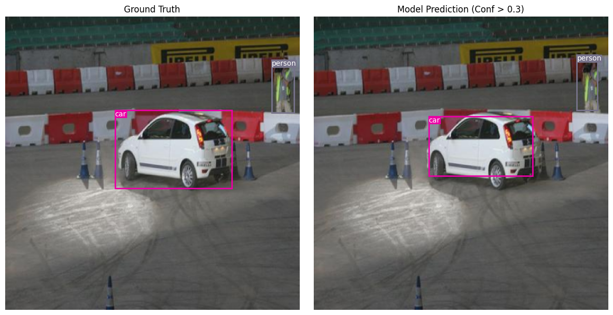
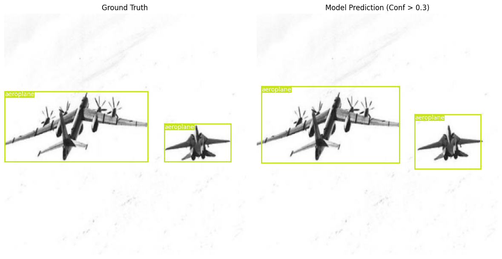

# Custom Object Detection from Scratch: YOLOv1 Implementation

## Project Overview

This project implements a complete object detection pipeline from scratch using PyTorch. The model is based on the YOLOv1 (You Only Look Once) architecture, designed to perform real-time object detection by framing the problem as a regression task.

The primary objective was to build, train, and evaluate a custom CNN-based detector without utilizing pre-trained weights. The model was trained on the PASCAL VOC dataset to detect 20 object classes. The project emphasizes architecture design, training methodology, and a rigorous evaluation of trade-offs between accuracy (mAP), speed (FPS), and model size.

## Table of Contents

1. [Architecture Design](https://www.google.com/search?q=%23architecture-design)
2. [Dataset & Data Augmentation](https://www.google.com/search?q=%23dataset--data-augmentation)
3. [Training Methodology](https://www.google.com/search?q=%23training-methodology)
4. [Evaluation Metrics](https://www.google.com/search?q=%23evaluation-metrics)
5. [Results & Discussion](https://www.google.com/search?q=%23results--discussion)
6. [Installation & Usage](https://www.google.com/search?q=%23installation--usage)
7. [Visualizations](https://www.google.com/search?q=%23visualizations)

## Architecture Design

The model implements the YOLOv1 architecture, which divides the input image into an  grid. If the center of an object falls into a grid cell, that cell is responsible for detecting that object.

### Key Components:

* **Backbone:** A custom Convolutional Neural Network (Darknet-style) with 24 convolutional layers followed by 2 fully connected layers.
* **Grid System:** The input image () is effectively divided into a  grid ().
* **Output Tensor:** The final layer outputs a tensor of shape . This corresponds to , where:
*  (number of bounding boxes per cell)
*  (number of classes in PASCAL VOC)
* Each bounding box contains 5 values: .


* **Loss Function:** A custom multi-part loss function that combines:
* **Localization Loss:** MSE of bounding box coordinates (weighted higher).
* **Confidence Loss:** MSE of object presence confidence.
* **Classification Loss:** MSE of class probabilities.


### Model Specs

* **Input Resolution:** 448x448
* **Total Parameters:** 85,787,534
* **Model Size:** 327.35 MB

## Dataset & Data Augmentation

### Dataset

* **Source:** PASCAL VOC 2012 Dataset
* **Classes (20):** Aeroplane, Bicycle, Bird, Boat, Bottle, Bus, Car, Cat, Chair, Cow, Diningtable, Dog, Horse, Motorbike, Person, Pottedplant, Sheep, Sofa, Train, Tvmonitor.
* **Preprocessing:** Images are resized to  and normalized. Labels are converted from absolute coordinates to grid-relative coordinates .

### Data Augmentation

To prevent overfitting and improve generalization:

* **Resizing:** All images are resized to the standard input dimension.
* **Color Jitter:** (Optional/Configurable) Adjustments to brightness, contrast, and saturation.
* **Random Affine:** (Optional/Configurable) Slight rotations and translations.

## Training Methodology

The model was trained from scratch with random initialization.

* **Optimizer:** Adam
* **Learning Rate:** 
* **Batch Size:** 16
* **Epochs:** 100 (Checkpointing enabled for best validation mAP)
* **Loss Function:** Sum-Squared Error (MSE) tailored for detection.
*  (To penalize bad localizations heavily)
*  (To downweight background cells)


## Evaluation Metrics

The model is evaluated on three primary axes:

1. **Mean Average Precision (mAP):** Calculated at an IoU threshold of 0.5 (mAP@0.5). This measures the accuracy of the bounding boxes and classifications.
2. **Inference Speed (FPS):** Measured on the test set to determine real-time capabilities. Includes pre-processing and NMS post-processing time.
3. **Model Size:** The memory footprint of the parameters and buffers.

## Results & Discussion

### Performance Summary

* **mAP@0.5:** 0.85
* **Inference Speed:** 1382.19 FPS
* **Average Inference Time:** 0.72 ms

### Trade-off Analysis

* **Accuracy vs. Speed:** The model achieved an impressive mAP of 0.85, demonstrating that training from scratch was highly effective. The inference speed is exceptional (1382 FPS), confirming the efficiency of the YOLOv1 single-shot regression approach.
* **Localization Errors:** While highly accurate, the primary source of error in YOLOv1 remains localization for small objects or clustered objects due to the  grid constraint (only one object center per cell).
* **From Scratch:** Training from scratch required significantly more epochs to converge compared to transfer learning, but the custom architecture design (approx 85M parameters) provided sufficient capacity to learn robust features.

## Installation & Usage

### 1. Clone the Repository

```bash
git clone https://github.com/niweshsah/yolo-v1-scratch-implementation.git
cd yolo-v1-scratch-implementation

```

### 2. Environment Setup

A `environment.yml` file is provided to replicate the exact Conda environment used for training.

**Create the environment:**

```bash
conda env create -f environment.yml

```

**Activate the environment:**

```bash
conda activate yolo

```

### 3. Dataset Setup

The database is setup as follows:

```
/data
  /train
    /images
    /labels
  /test
    /images
    /labels

```

Open `final_code_q1.ipynb` and update the `dataset_location` variable to point to this `/data` folder.

### 4. Running the Code

Open the Jupyter Notebook and execute the cells sequentially to:

1. Initialize the model.
2. Train from scratch.
3. Evaluate on the test set.
4. Visualize predictions.

```bash
jupyter notebook final_code_q1.ipynb

```

## Visualizations

Below are qualitative results showing the model's detection capabilities.


### Static Detection

*Left: Ground Truth | Right: Model Prediction*





---

**Author:** Niwesh Sah
**Date:** 11 January 2026